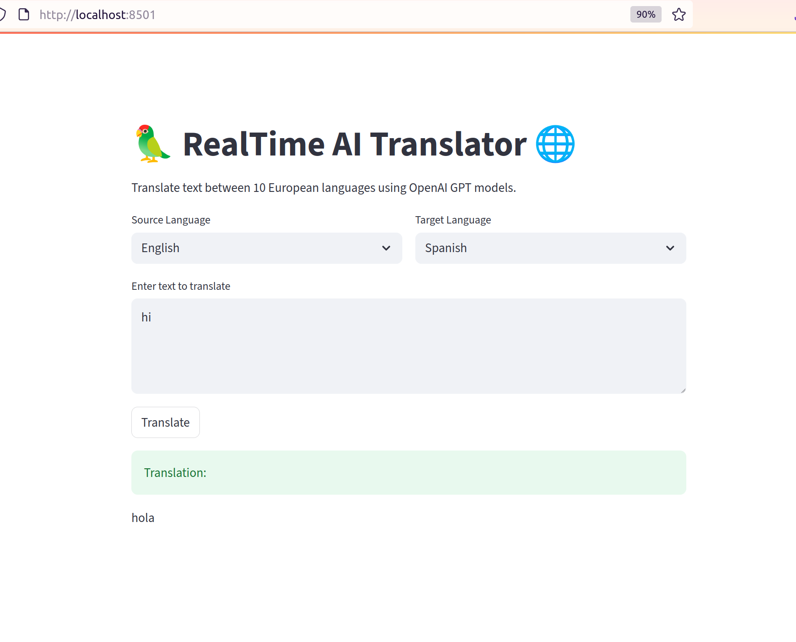

# Multilingual Translation App

## Overview

This application enables translation of text between 10 European languages using OpenAI's GPT models.
Languages supported: German (de), English (en), Greek (el), Spanish (es), French (fr), Italian (it), Polish (pl), Portuguese (pt), Romanian (ro), Dutch (nl).

The app provides a simple web UI built with Streamlit, allowing users to select source and target languages, input text, and get AI-powered translations.


---

## Features

- Translate between any pair of the supported 10 languages
- Context-aware, fluent translations using OpenAI GPT-4 or GPT-3.5
- Lightweight and easy-to-use web interface
- Runs locally or deployable on cloud platforms

---

## Architecture

- **Frontend:** Streamlit app
- **Backend:** Calls OpenAI API for translations
- **Deployment:** Local or cloud with Python 3.8+ environment

Data flow:

1. User selects source and target languages and enters text.
2. App sends a prompt to OpenAI GPT to perform translation.
3. AI returns translated text displayed in the UI.

---

## Setup and Run Locally

### Prerequisites

- Python 3.12 or newer
- OpenAI API key (sign up at [OpenAI](https://platform.openai.com/))

### Installation

You can run the app locally by following these steps:
```bash
git clone https://github.com/olavrova/realtime_ai_translator.git
cd realtime_ai_translator
python -m venv venv
source venv/bin/activate   # On Windows: venv\Scripts\activate
pip install -r requirements.txt
export OPENAI_API_KEY="your_api_key"   # Windows: set OPENAI_API_KEY=your_api_key
streamlit run app/translate_app.py
```

Open your browser at http://localhost:8501 and start translating!

## Potential Risks and Ethical Considerations

    Translation Accuracy: AI translations may have errors or misinterpret context; not recommended for legal or critical documents without review.

    Bias: AI models may reflect biases present in training data affecting translations.

    Data Privacy: User inputs are sent to OpenAI servers; avoid sensitive/confidential data or ensure compliance with privacy policies.

    Dependency: App depends on external API availability and may incur usage costs. Big volumes of requests could lead to rate limiting or increased costs.

## Scalability Considerations

- **API Rate Limits & Quotas:**  
  OpenAI API has usage limits and rate quotas. For heavy traffic, plan for batching requests or acquiring higher quota plans.
  To avoid limits also consider to use other models (see Way to improve the app section below).

- **Cost Management:**  
  Translation via GPT models incurs cost per token. Monitor usage and optimize prompt length to reduce expenses.

- **Concurrent Users:**  
  Streamlit is designed for light to medium traffic. For higher concurrency, consider deploying behind a scalable web server or using serverless/cloud functions.

- **Caching Translations:**  
  Implement caching (e.g., Redis, in-memory) for repeated translations to reduce API calls and improve latency.

- **Load Balancing & Horizontal Scaling:**  
  Deploy multiple app instances behind load balancers to distribute user requests efficiently.

- **Fallback Mechanisms:**  
  Design fallback or queue systems to handle API downtime or throttling gracefully, ensuring user experience continuity.

- **Asynchronous Processing:**  
  For bulk or long-running translations, consider asynchronous jobs or background workers to offload processing.

Adding these considerations helps ensure the app can grow and serve more users reliably without degrading performance or incurring unexpected costs.

## Way to improve the app
- **Using Lower-Cost Models:**  
  Use `gpt-3.5-turbo` instead of `gpt-4` where acceptable, as it is cheaper and faster while maintaining good translation quality.

- **Hybrid Approach with Open-Source Models:**  
  Combine OpenAI with open-source models like [MarianMT](https://huggingface.co/Helsinki-NLP), [M2M100](https://huggingface.co/facebook/m2m100_418M), or [NLLB](https://huggingface.co/facebook/nllb-200-distilled-600M) for less frequent or less complex translations.

### License

This project uses OpenAI API under its terms of service. The app code is licensed under MIT License.

